# Module dependency graph

Generated by `./gradlew generateModuleGraph`.
Checked by `./gradlew checkModuleGraph` and the root `check` task.

## Production dependencies

```mermaid
graph TD
    app[":app"]
    benchmark[":benchmark"]
    core[":core"]
    core_common[":core:common"]
    core_database[":core:database"]
    core_datastore[":core:datastore"]
    core_designsystem[":core:designsystem"]
    core_domain[":core:domain"]
    core_model[":core:model"]
    core_network[":core:network"]
    core_notifications[":core:notifications"]
    core_scheduling[":core:scheduling"]
    core_storage[":core:storage"]
    core_testing[":core:testing"]
    core_ui[":core:ui"]
    feature[":feature"]
    feature_auth[":feature:auth"]
    feature_history[":feature:history"]
    feature_insights[":feature:insights"]
    feature_materials[":feature:materials"]
    feature_settings[":feature:settings"]
    feature_tasks[":feature:tasks"]
    feature_timer[":feature:timer"]
    app --> core_common
    app --> core_database
    app --> core_datastore
    app --> core_designsystem
    app --> core_network
    app --> core_notifications
    app --> core_scheduling
    app --> core_storage
    app --> feature_auth
    app --> feature_history
    app --> feature_insights
    app --> feature_materials
    app --> feature_settings
    app --> feature_tasks
    app --> feature_timer
    core_common --> core_model
    core_database --> core_domain
    core_database --> core_model
    core_datastore --> core_model
    core_domain --> core_common
    core_domain --> core_model
    core_notifications --> core_common
    core_scheduling --> core_common
    core_scheduling --> core_database
    core_scheduling --> core_datastore
    core_scheduling --> core_domain
    core_scheduling --> core_model
    core_scheduling --> core_notifications
    core_scheduling --> core_storage
    core_storage --> core_domain
    core_testing --> core_common
    core_testing --> core_domain
    core_testing --> core_model
    core_testing --> core_network
    core_ui --> core_designsystem
    core_ui --> core_domain
    feature_auth --> core_common
    feature_auth --> core_domain
    feature_auth --> core_model
    feature_history --> core_common
    feature_history --> core_designsystem
    feature_history --> core_domain
    feature_history --> core_model
    feature_history --> core_ui
    feature_insights --> core_common
    feature_insights --> core_domain
    feature_insights --> core_model
    feature_materials --> core_common
    feature_materials --> core_designsystem
    feature_materials --> core_domain
    feature_materials --> core_model
    feature_materials --> core_ui
    feature_settings --> core_common
    feature_settings --> core_datastore
    feature_settings --> core_designsystem
    feature_settings --> core_domain
    feature_settings --> core_model
    feature_settings --> core_notifications
    feature_settings --> core_ui
    feature_tasks --> core_common
    feature_tasks --> core_designsystem
    feature_tasks --> core_domain
    feature_tasks --> core_model
    feature_tasks --> core_ui
    feature_timer --> core_common
    feature_timer --> core_designsystem
    feature_timer --> core_domain
    feature_timer --> core_model
    feature_timer --> core_ui
```

## Test-only project dependencies

| Module | Test dependency |
|---|---|
| `:app` | `:core:testing` |
| `:core:database` | `:core:testing` |
| `:core:domain` | `:core:testing` |
| `:core:notifications` | `:core:testing` |
| `:core:scheduling` | `:core:testing` |
| `:core:storage` | `:core:testing` |
| `:feature:auth` | `:core:testing` |
| `:feature:history` | `:core:testing` |
| `:feature:insights` | `:core:testing` |
| `:feature:materials` | `:core:testing` |
| `:feature:settings` | `:core:testing` |
| `:feature:tasks` | `:core:testing` |
| `:feature:timer` | `:core:testing` |
